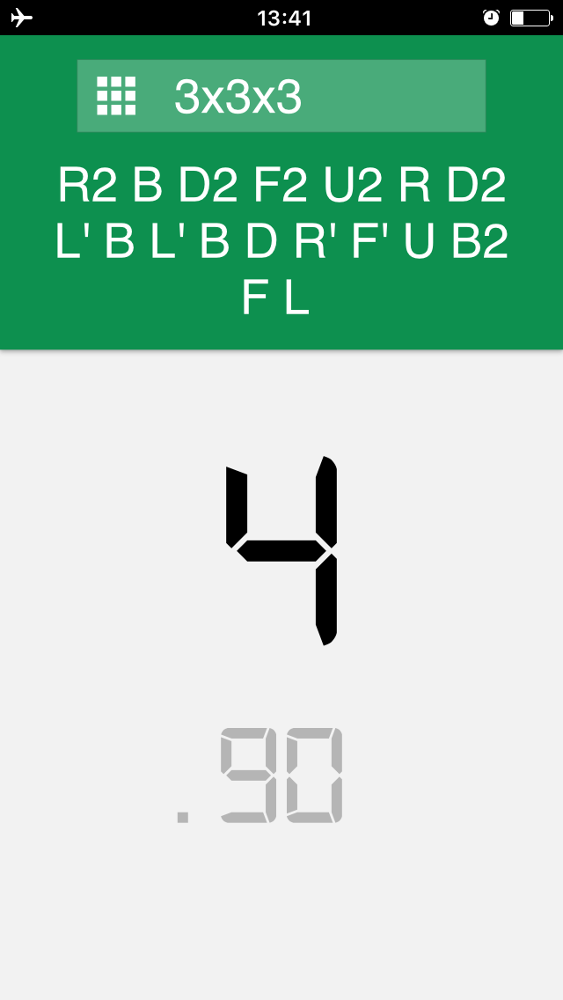
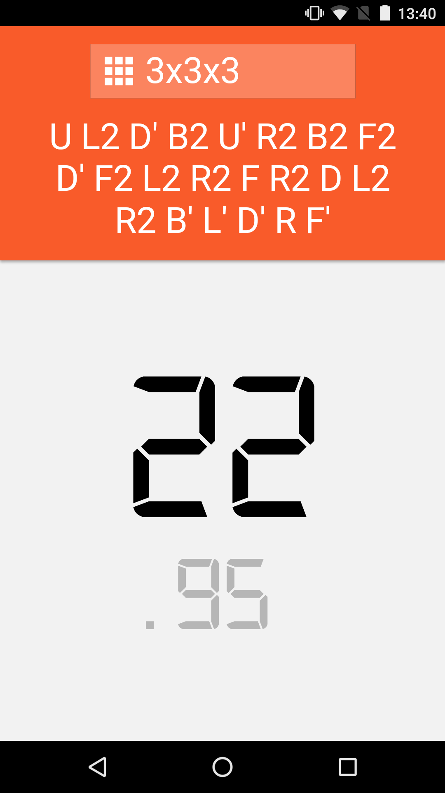

# timer.cubing.net

A simple cubing timer.

- Simple, clean design.
- Works on all major browsers on any size screen or smartphone.
  - Try "Add to Home Screen" from your phone's browser to use it like an app!
- Supports all official WCA puzzles with random-state scrambles for most puzzles (using [JSSS](https://github.com/cubing/jsss)).
- Works offline.

## License

MIT
