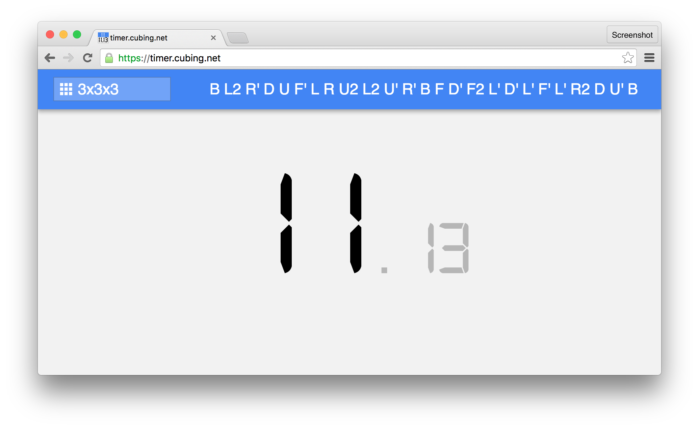
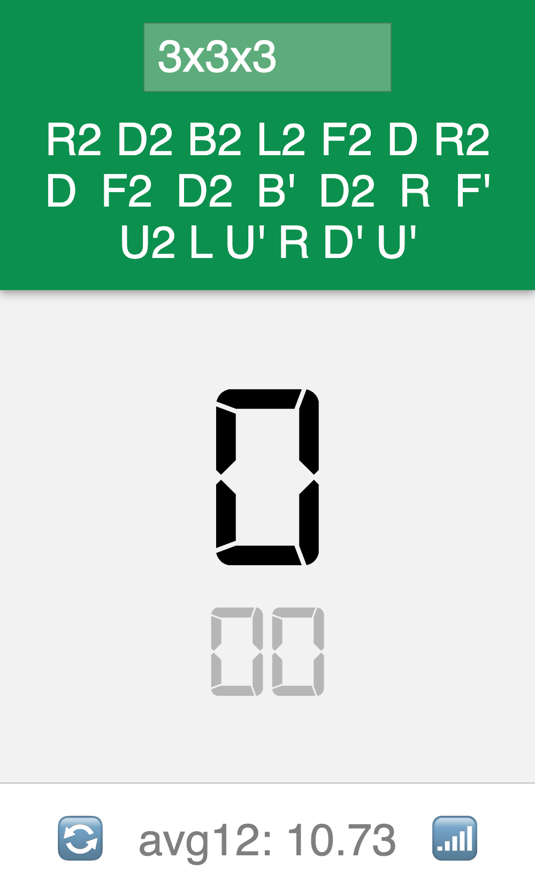

# timer.cubing.net

A simple cubing timer.

- Simple, clean design.
- Works on all major browsers on any size screen or smartphone.
  - Try "Add to Home Screen" from your phone's browser to use it like an app!
- Random-state scrambles for all supported puzzles
- Works offline.
- Instant session syncing across devices.
  - Syncs instantly while online, or continues recording offline and syncs immediately the next time you're online.

 

## License

MIT
